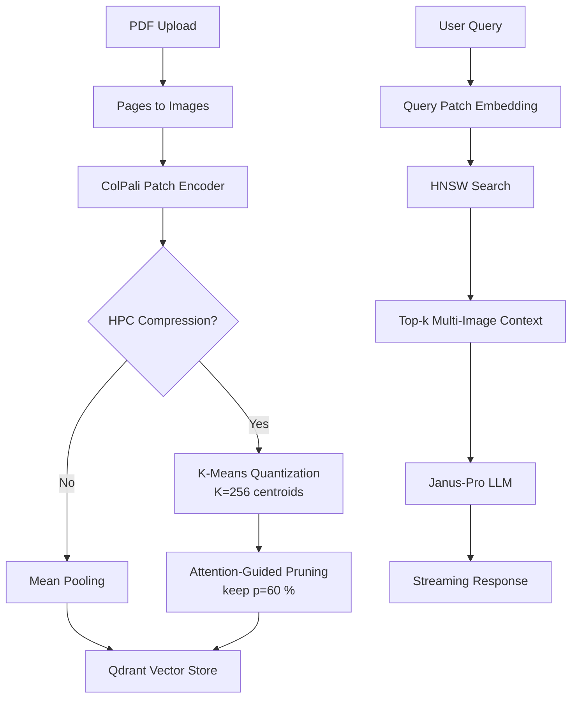

#  Multimodal RAG with HPC-ColPali and Janus

A high-performance **Multimodal Retrieval-Augmented Generation (RAG)** system that combines visual document understanding with conversational AI. Built with **HPC-ColPali** for efficient visual embeddings and **Janus-Pro** for multimodal reasoning.


##  Key Features

- Visual Document Understanding: Process PDFs with advanced visual comprehension
- HPC-ColPali Optimization: Hierarchical Patch Clustering for 3x faster retrieval
- Multimodal Reasoning: Janus-Pro model for contextual Q&A
- Efficient Storage: Qdrant vector database with optimized indexing
- High Accuracy: Multi-image context synthesis for comprehensive answers

## System Architecture

##  Research Foundation

This implementation is based on the **HPC-ColPali** research paper:

> **"Hierarchical Patch Clustering for Efficient Visual Retrieval"**  
> [Read Paper](https://arxiv.org/html/2506.21601v1)

## Performance Comparison

| Method            | Latency (ms) | Memory (GB) | nDCG\@5   |
| ----------------- | ------------ | ----------- | --------- |
| ColPali (float32) | 120          | 2.56        | 0.845     |
| **HPC-ColPali**   | **40**       | **0.80**    | **0.847** |


## Installation

### Prerequisites
- Python 3.8+
- CUDA-compatible GPU (recommended)
- Qdrant vector database

### Setup

```bash
# Clone the repository
git clone https://github.com/yourusername/multimodal-rag-hpc-colpali.git
cd multimodal-rag-hpc-colpali

# Create virtual environment
python -m venv venv
source venv/bin/activate  # On Windows: venv\Scripts\activate

# Install dependencies
pip install -r requirements.txt

# Start Qdrant (using Docker)
docker run -p 6333:6333 -p 6334:6334 qdrant/qdrant
```

## Quick Start

### 1. Launch the Application
```bash
streamlit run streamlit_app.py
```

### 2. Upload & Process Documents
- Upload your PDF documents through the sidebar
- Wait for automatic processing and embedding generation
- HPC codebook is built automatically for optimal performance

### 3. Start Chatting
- Ask questions about your uploaded documents
- Get contextual answers with multi-image reasoning
- Enjoy real-time streaming responses

## Configuration

Customize your setup via `config.yaml`:

### Core Modules

| Component | Description | File |
|-----------|-------------|------|
| Embedder | HPC-ColPali visual embeddings | `src/embedder.py` |
| Vector Store | Qdrant integration with optimization | `src/vector_store.py` |
| RAG Pipeline | End-to-end retrieval and generation | `src/rag_pipeline.py` |
| HPC Module | Hierarchical patch clustering | `src/hpc_colpali.py` |
| Utilities | Helper functions and optimizations | `src/utils.py` |

### Web Interface
- Streamlit App: `streamlit_app.py` - Interactive web interface with document upload and chat

### Vector Processing Flow

1. Image Preprocessing: PDF pages → PIL Images
2. Patch Extraction: Vision transformer patch encoding
3. Clustering: K-means with optimized centroids
4. Pruning: Attention-based patch selection
5. Storage: Compressed vectors in Qdrant
6. Retrieval: Fast similarity search with decompression

## Performance Optimization

- Batch Processing: Optimized batch sizes for GPU memory
- Memory Management: Automatic garbage collection and cache clearing
- Mixed Precision: BFloat16 for faster inference
- Streaming: Real-time response generation


##  Acknowledgments

- HPC-ColPali Research: [Hierarchical Patch Clustering Paper](https://arxiv.org/html/2506.21601v1)
- ColPali Framework: Visual document understanding foundation
- Janus-Pro Model: Multimodal reasoning capabilities
- Qdrant: High-performance vector database
